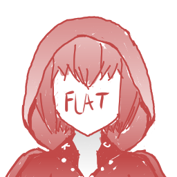
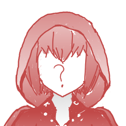
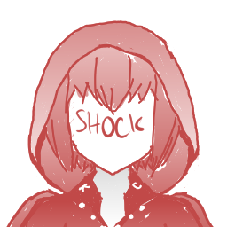
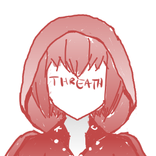
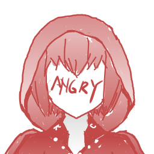
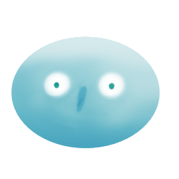

# CosmicKeepers

## About the game
Game ini menceritakan petualangan The Keeper menjaga cosmic (jiwa) para manusia. Namun, seringkali cosmic yang mengalami trauma malahan berbalik menyerang The Keeper seperti cosmic yang mengalami trauma berat akibat peperangan

- All The Assets are Hand-Painted

## Game Architecture - State Machine
Pengembangan game ini menggunakan State Machine Design Pattern dikarenakan keunggulan design pattern ini dapat memberikan clean arsitektur ketika melakukan development dengan membagi tugas menjadi state - state.

- [State Machine](/Assets/Scripts/StateMachine/StateMachine.cs)
- [State and Enum](/Assets/Scripts/StateMachine/State.cs)

## Dialogue System
Menggunakan Node based Graph dari [Dialogue System By Morh](https://github.com/merpheus-dev/NodeBasedDialogueSystem) dengan fitur - fitur sebagai berikut

Morph Feature
- Infinite Branching and Merging dialogue capability.
- Dialogue&Graph save/load system.

My Feature
- MainStory Branching Graph
    - Membuat alur cerita yang bercabang
    - Memungkinkan terjadinya perbedaan ending
    - 

- Drag & Drop Utility 
    - Dalam load&save file, morph berlandaskan pada file name sehingga rawan terjadi kesalahan

- Emotions Attribut
    - Memungkikan dialogue loader untuk melakukan filter pada text sehingga sprite placeholder karakter dapat berubah - ubah sesuai emosi

- Linked Dialogue File

## Emotions

## Item

